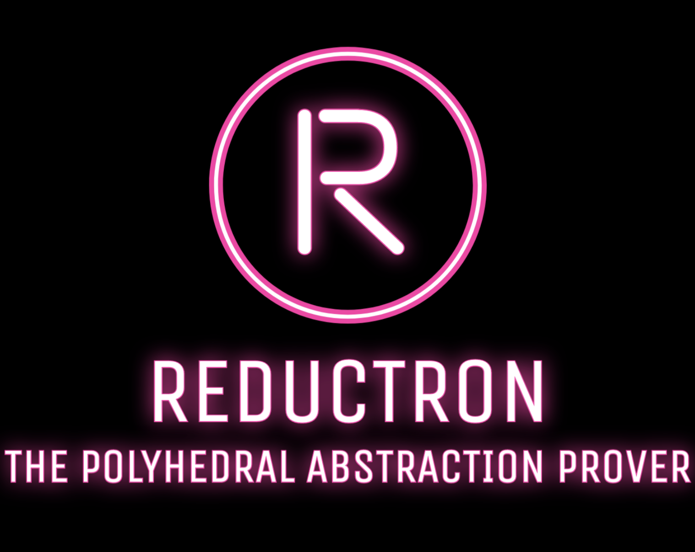

# Reductron - Automated Polyhedral Abstraction Prover

<br />
<p align="center">
  <a href="https://github.com/nicolasAmat/Reductron">
    
  </a>
</p>

## About


Reductron is a tool that permits to prove that some parametric polyhedral
equivalence, say $(N_1, C_1) \approxeq_E (N_2, C_2)$, is correct. The tool relies
on the tool FAST and the SMT solver z3.

## Dependencies

+ [TaPAS](https://tapas.labri.fr/wp/?page_id=98) - The Talence Presburger Arithmetic Suite
+ [FASTer](https://tapas.labri.fr/wp/?page_id=98) - A tool for the analysis of large or even infinite systems
+ `ndrio` from the [TINA Toolbox](http://projects.laas.fr/tina/) - Petri nets converter
+ [z3](https://github.com/Z3Prover/z3) - SMT solver

## Installation

The tool can be installed using `pip`:
```
$ python setup.py bdist_wheel
$ python -m pip install --user dist/reductron-1.0-py3-none-any.whl
```

Note that the `wheel` package is required, you can install it using:
```
$ pip3 install --user wheel
```

## Usage

Examples of correct and incorrect polyhedral equivalences can be found in the `rules/` directory.

To check an equivalence run:
```
$ python3 -m reductron -i <initial.net> -r <reduced.net>
```

You can list all the options by using the *help* option:
```
$ python3 -m reductron -h
usage: __main__.py [-h] [--version] [-v] [--debug] -i initial -r reduced [--show-time]

Reductron - Automated Polyhedral Abstraction Prover

options:
  -h, --help            show this help message and exit
  --version             show the version number and exit
  -v, --verbose         increase output verbosity
  --debug               print the SMT-LIB input/output
  -i initial, --initial-net initial
                        path to the initial Petri Net (.net format)
  -r reduced, --reduced-net reduced
                        path to the reduced Petri Net (.net format)
  --show-time           show the execution time
```

## References

- Amat, N, Dal Zilio, S, Le Botlan, D. [Automated Polyhedral Abstraction
  Proving](https://doi.org/10.1007/978-3-031-33620-1_18). *Application and
  Theory of Petri Nets and Concurrency (Petri Nets)*. 2023.

## License

This software is distributed under the
[GPLv3](https://www.gnu.org/licenses/gpl-3.0.en.html) license. A copy of the
license agreement is found in the [LICENSE](./LICENSE) file.

## Authors

* **Nicolas AMAT** -  [LAAS/CNRS](https://www.laas.fr/)
